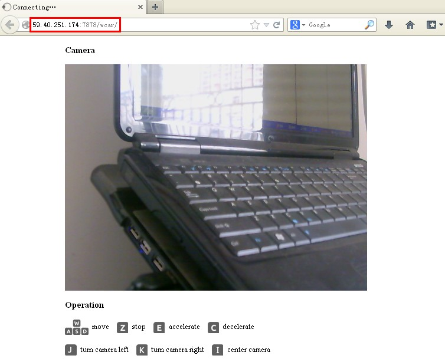

# Wifi Car #
Easily build a Wi-Fi car with open source technologies.

## **Introduction** ##

Harware

- a route - TP Link WR703N or Fast FWR171-3G 
- an Arduino board
- a car with motor driver
- a USB Hub(optional)
- a USB camera

Software

- OpenWrt, a GNU/Linux based firmware program for embedded devices such as residential gateways and routers.
- Arduino
- Android app to control the car remotely.
- Web browser to access web UI of the car.


## **File Structure** ##

    android - Android app and source code
	arduino - Arduino sketch to control wificar, support with Car Driver Shield of Elechouse
    doc     - related documents
    image   - related images
    openwrt - contents in `openwrt` is used to custom openwrt firmware
    release - bins which are used to upgrade openwrt 

## **How To** ##
This section shows you how to build a WifiCar with Elechouse's WifiCar Kits.

### Prepare ###

- CarDriverShield with an Arduino Nano on it.
- A car with 4 motors on it
- An openwrt router (TP-Link WR703N or FAST FWR171-3G) with the firmware in this repository.
- A USB Hub
- A USB camera.
- Several USB cables and some wire.
- **Also a powerful battery**. (Elechouse's kits do not contain any battery)

### Assemble ###
(UNFINISHED)

### WifiCar Control ###
This section introduce you 3 ways to control your WifiCar

- **Connect with WifiCar directly**
- **Connect WifiCar with another router, control through LAN**
- **Connect WifiCar with another router, control Through Internet**

#### Direct connect WifiCar ####

This is the simplest way to control your WifiCar. Just connect your PC(or Android Mobile device) and control your WifiCar use browser(through App when using Android Mobile device).

1. connect with the WiFi car through WiFi. The SSID of the WiFi car is 
"wifi-car", by default there is not password, if needed set it by yourself.
2. access the WiFi car through web browser or android app - WiFi Car. <http://192.168.1.1/car>

	a) web browser

		URL                                     Description
		----------------------------------------------------
		http://192.168.1.1/car                  web UI 
		http://192.168.1.1:8080?action=stream   camera
		http://192.168.1.1/cgi-bin/serial       cgi script to send data

    b) Android app - WiFi Car

        	just run the app.


#### Through LAN ####

Control you WifiCar through another router, by this, you don't need to disconnect from your LAN, and you can control your WifiCar while surfing.

1. After you assemble your WifiCar, power on your WifiCar
1. For first time using you need to configure your Tp-link WR703n(or FWR171-3G), connect your PC with the WifiCar Router(SSID: **wifi-car**, or you can connect your WifiCar through **network cable**).
1. Access **192.168.1.1** and you will see like the picture below, by default **no password**, click **Login** button to log in.

1. Click **network** -> **wifi**, and click **Scan** button to search your WIFI. Here I select our wifi name **elechouse**. Click **Join Network**.
	
	
1. Fill your Wifi information. Click **submit**.
	
1. In the new window click **save&apply**.
	
	
1. Click **Network** check the configuration. Click **Status** to see your IP, my WifiCar IP is **192.168.1.107**.
	
	
1. For avoiding IP address collision, change the **gateway** of your **WifiCar router** to **192.168.2.1** (or another except hostname of your **Wireless Router**). Click **Network** -> **Interfacea** -> **Edit**, fill the new **IPv4 Address**, and **Save&Apply**.
	
	

1. Now your **WifiCar router** has been configurated. Reconnect to your personal WIFI, access <http://192.168.1.107/car> (replace 192.168.1.107 with your WifiCar ip), if all things go well you can see this:
	

1. Now you can control your WifiCar through browser. Usage: 
    - w --> forward
    - s --> backward
    - a --> turn left
    - d --> turn right
    - e --> accelerate
    - c --> decelerate
    - z --> stop
    - i --> up
    - k --> down
    - j --> left
    - l --> right
    - o --> center 


#### Through Internet ####

To control your WifiCar through Internet, you need set your Router **Port Forward** rule, this may be different between routers, here is an example of Openwrt router.

1. Log in your **Openwrt** router(**NOT WifiCar Router**).
1. **Network** -> **Firewall** -> **Port Forwards**. Add camera port(8080) forward :
	- **Name** -> camera
	- **Protocol** ->  TCP(TCP+UDP also work)
	- **External Port** -> **7879** 
	- **Internal IP address**(means LAN device ip) -> **Your WifiCar IP(Mine is 192.168.1.107)**
	- **Internal Port** -> 8080

	
1. Click **Add**.
1. Add www port(80) forward :
	- **Name** -> **www**
	- **Protocol** ->  TCP(TCP+UDP also work)
	- **External Port** -> **7878** 
	- **Internal IP address**(means LAN device ip) -> **Your WifiCar IP(Mine is 192.168.1.107)**
	- **Internal Port** -> **80**
1. Click **Add**
1. Click **Save&Apply**
1. To avoid unnecessary trouble,restart your router. 
1. Log in your router again, check your personal router IP address, **Status** -> **Network** -> **IPv4 WAN Status**, from the picture you can see my ip is **59.40.251.174**, then access <http://59.40.251.174:7878/wcar> to control your WifiCar.
	
	


## **Technical Detail** ##

This section shows the curious man how **WifiCar** works.

### Working principle ###

### Build Openwrt ###

See :

[Image Generator](http://wiki.openwrt.org/doc/howto/obtain.firmware.generate) 

[定制WR703N的OpenWrt固件](https://github.com/xiongyihui/wifi-car/wiki/%E5%AE%9A%E5%88%B6WR703N%E7%9A%84OpenWrt%E5%9B%BA%E4%BB%B6) (Chinese)

###Communication protocol ###

The Arduino board reads command from serial port, the command is sent by user through WIFI. A command consists with a character and a LF('\n'). At present **Arduino board** never send any data to the **wifi-car router**.

	Commands        functions
	-----------------------------
	w               forward
	a               turn left
	s               backward
	d               turn right
	z               stop
	e               accelerate
	c               decelerate
	i               camera up
	k               camera down
	j               camera left
	l               camera right
	o               center camera

 ## Failsafe
 In some unpredicted cases, openwrt may be bricked, you cann't connect your pc with Openwrt, or you forget the password you set, then you need save your Openwrt router.

- configure your PC ipaddress `192.168.1.2`, gateway `192.168.1.1`, mask `255.255.255.0`
- find something small enough, use to push the reset button
- restart the FW171/WR703n, push the reset button as soon as the LED blink first time
- After pushing the reset button, you can see the LED bink quickly, that means you have let the router go into the failsafe mode. If not, redo previous steps.
- connect router with you PC with one network cable, then run command `telnet 192.168.1.1`, then you'll find you've went into the Openwrt console

	 	```
		=== IMPORTANT ============================
		  Use 'passwd' to set your login password
		  this will disable telnet and enable SSH
		 ------------------------------------------


		BusyBox v1.19.4 (2012-11-18 02:19:39 UTC) built-in shell (ash)
		Enter 'help' for a list of built-in commands.

		  _______                     ________        __
		 |       |.-----.-----.-----.|  |  |  |.----.|  |_
		 |   -   ||  _  |  -__|     ||  |  |  ||   _||   _|
		 |_______||   __|_____|__|__||________||__|  |____|
		          |__| W I R E L E S S   F R E E D O M
		 -----------------------------------------------------
		 ATTITUDE ADJUSTMENT (12.09-rc1, r34185)
		 -----------------------------------------------------
		  * 1/4 oz Vodka      Pour all ingredients into mixing
		  * 1/4 oz Gin        tin with ice, strain into glass.
		  * 1/4 oz Amaretto
		  * 1/4 oz Triple sec
		  * 1/4 oz Peach schnapps
		  * 1/4 oz Sour mix
		  * 1 splash Cranberry juice
		 -----------------------------------------------------
		root@(none):/# 
	 	```
	- To reset password, run command `passwd`, then input your new password twice.
	- To reset router to default, run command `firstboot`
	- to restart your router, run command `reboot -f`
	  
## **BUY** ##
[Wifi Car Kits](http://www.elechouse.com)